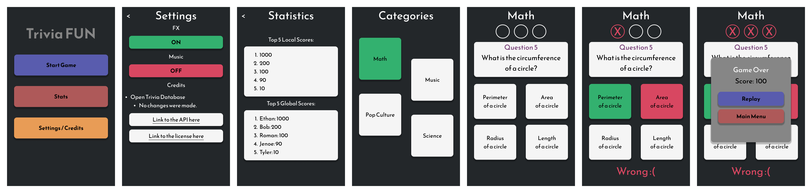

# Triviafun

This is a trivia mobile application for Android. This app uses API requests from the Open Trivia API. It turns the requested information (questions, answers, difficulty level) into a playable game with many different categories and an increasing difficulty.

## Layout

## Technology Choices

To target Android mobile users, I chose Android Studios as the platform as it is the native and recommended way to create apps for Android. I also chose Kotlin as it is the officially supported language for app development.

However, if the focus was cross-platform compatibility the better choice would be React Native.

## Learned

- Proper asynchronous API calls that don't block threads
- Image scaling for all screen sizes

## How to Install and Use
1. Clone this repository down to your computer.
2. Through Android Studios, open the build.gradle file in the surface directory.
3. In the top right area of the topbar, click the green arrow to emulate the app.
